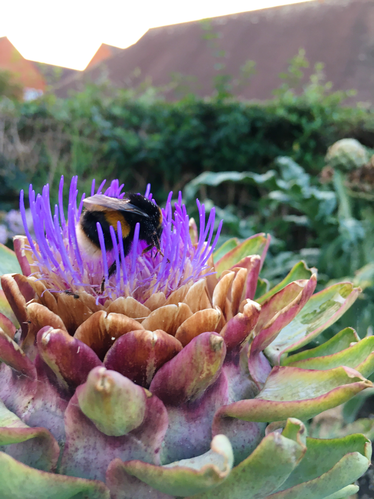

This is a strange little story that led me to have a strong realisation - an epiphany, if you will - about how we live our lives. 
I was sitting on my sofa feeling some negative emotions, like imposter syndrome, perfectionism, self-judgement etc. I was ranting into my journal and the last sentence I wrote before a giant bumble bee flew into my bookshelf and hid behind some books was, "What do I need to do??? To..." I didn't get a chance to finish the thought as I felt I had to go and help the bee which I found clinging to a book with a rainbow on it's cover. That's not really important for the story but it makes me wonder how the bee could confuse a flower with a picture of a rainbow on a book. Anyway, after a few seconds of removing all the books and trying to gently prompt this bee to fly away, careful not to scare it, it flew over towards the wide open window... but ended up bashing into the closed window next to it. Again, I gently wafted it out and eventually it made it back outside. I bet you're wondering where the epiphany is in all of this rambling. Well I went back to my journal to carry on where I left off, reading over the last sentence to remind me. "What do I need to do???" I asked myself. And I sighed and smiled, "To treat myself like I would treat a lost bee". To be gentle to myself, to step back and see the open window right next to where I'm banging my head against a closed one, to be kind to myself. It felt like a revelation, a mystical experience almost. Directly afterwards, as I was tidying the books away, I opened up a book called "Where Silence is Praise" by a Carthusian and just flipped it open to a random page. I don't know what caused me to do it, but I landed on the most beautful sentiment that just seemed to fit the situation so perfectly: 

> ***Why we suffer***

> *We are not fond of suffering, and, in one sense, we are right. We are made for happiness, and it should be the dream of our hearts, the aim of our existence. We are not wrong to seek happiness, but we are wrong to seek it along wrong paths. 
> Where are we to find it? In God alone. She is that mysterious Reality for whom we long in all that we desire, in all that we do. She hides herself in the depth of all created things, from which we ask happiness, and which cannot give it to us. They are the veil which hides the infinite beauty of her Face, and we suffer because we stop at that veil, instead of passing beyond it. When we pass beyond the veil and meet the Reality which is behind it all, then are we consoled, and our joy is full.*

God, He, She, the Void, the Still Small Voice, the Universe, whatever we decide to call it, is behind the veil of our reality (I actually edited the quote above, which is a translation of the original anyway, to overturn the automatic response to assume God is male). Sometimes out of the blue, we pass beyond that veil, or maybe we just catch a glance at what is beyond the veil, and somehow things are put into perspective - we are consoled and our joy is full. &#8718; 

