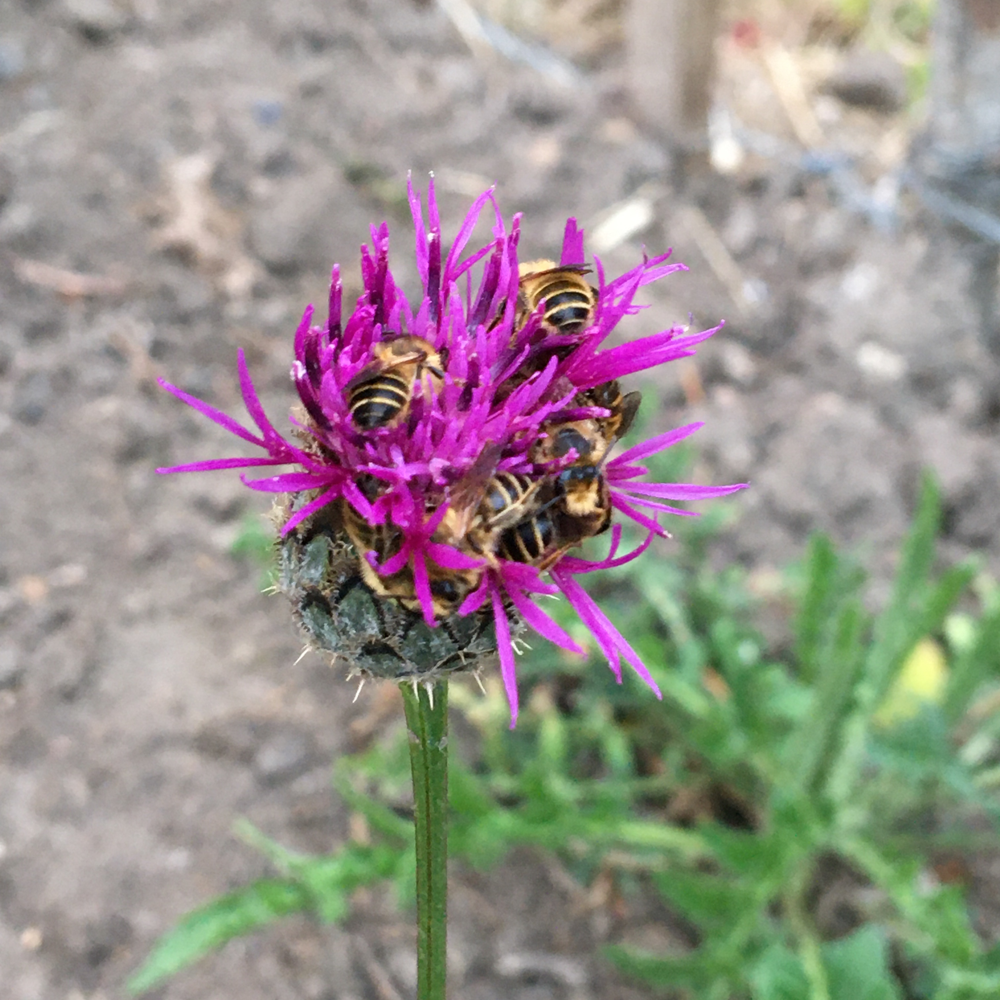

Have you ever seen anything like it? Bees sleeping in a flower. Apparently they spent a bit too much time in the sun, or got "nectar drunk" - cheeky bees! According to the internet it's a common occurance for a bee to find a particularly tasty flower if they can't get back to the nest before dark. What a lovely metaphor for life: if you find yourself too tired to push on, just find a really comfy place with tasty food and have a nap. Be more bee. &#8718;