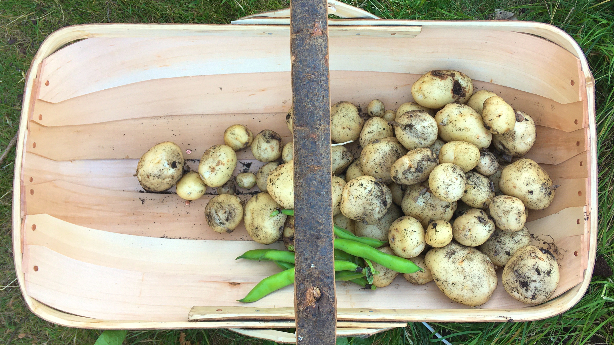
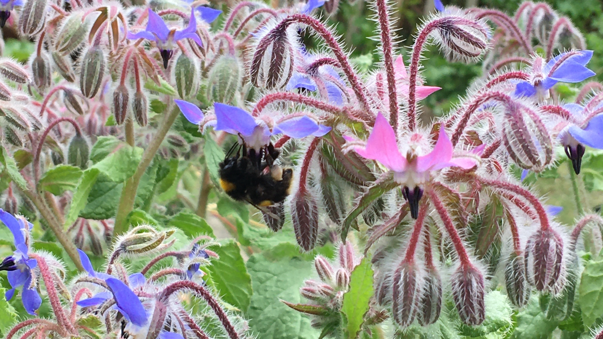

Slugs, aphids, ants, caterpillars, woodlice and what we can only assume was a giant fox poo - we've seen a lot in our attempts to grow some food for ourselves over the lockdown period. Our runner beans barely saw the light of day before being decimated by an unknown pest, leaving no evidence we even planted any, after spending weeks tending to the seedlings on the windowsill. The broadbeans have just been covered in aphids, which are tended to by a colony of ants that take them "home" at night to protect them and bring them back again the next morning so they have a never ending supply of "honeydew", aka aphid waste products. A beautifully disgusting example of symbiosis. We have managed to avoid too many slugs and caterpillers on our cabbages and kales, and the woodlice tend to hide in the lettuce rather than eat it, so hopefully *touch wood* that remains the case. I won't go into too many details about the fox poo other than it was ginormous but I can't think what other animals are roaming around a night time going to the toilet in asparagus beds. 

Anyway! Some plants that did very well were the potatoes. We found that putting two rows of four plants in our 10' by 4' beds was a little tight, especially when it came to "earthing up" the soil around the plants to increase the yield and prevent any of the tubers from turning green. In fact about a quarter of the potatoes were a smidge on the green side and we didn't want to risk it so we fed them to the worms. Next time we will plant them slightly lower, so there is more vertical space before the soil starts falling over the edges of the bed, and hopefully by then we will have a few more beds and we can experiment with a whole bed of potatoes that are spaced more efficiently. 

Another set of plants that have somehow been doing well are the tomatoes. We hadn't planned on growing tomatoes this year, but Mummy Drayson decided we would have a tomato growing competition and dropped off 5 plants. With nowhere to put them in the ground, we shoved them in some old ammo crates we found at the amazing market in Faversham ages ago and sort of neglected them really. The only care we gave them has been in the form of "oh sh*t! They're almost dead, water them quick!" Yet they have the same amount of juicy looking tomatoes as Mummy Drayson's very well looked after versions.

Other than that we are growing a LOT of flowers, very carefully spaced thanks to Drayson's verging-on-obsessive attention to detail (ready to self-seed literally anywhere they damn well please, I'm not sure why so much time was spent with a tape measure getting them in the "perfect" location, but you have to pick your battles wisely). Surprisingly everything is growing rather well! The companion plants are doing an okay job in keeping some pests away from our veggies, and we have butterflies and bees and hoverflies all over the place. The best flower by far is borage. I can't believe I had never heard of it before. Bees absolutely LOVE it. You can hear them from metres away, all over the borage flowers, it's my new favourite plant. I recommend every one get some for their gardens. I could sit for hours just listening to and watching the bees hopping from flower to flower. Not only that, but the seeds are food for wild birds, and once you have it, it'll self seed each year meaning you barely have to look after it, and the flowers and leaves are edible! An all round goodie in my book. &#8718;