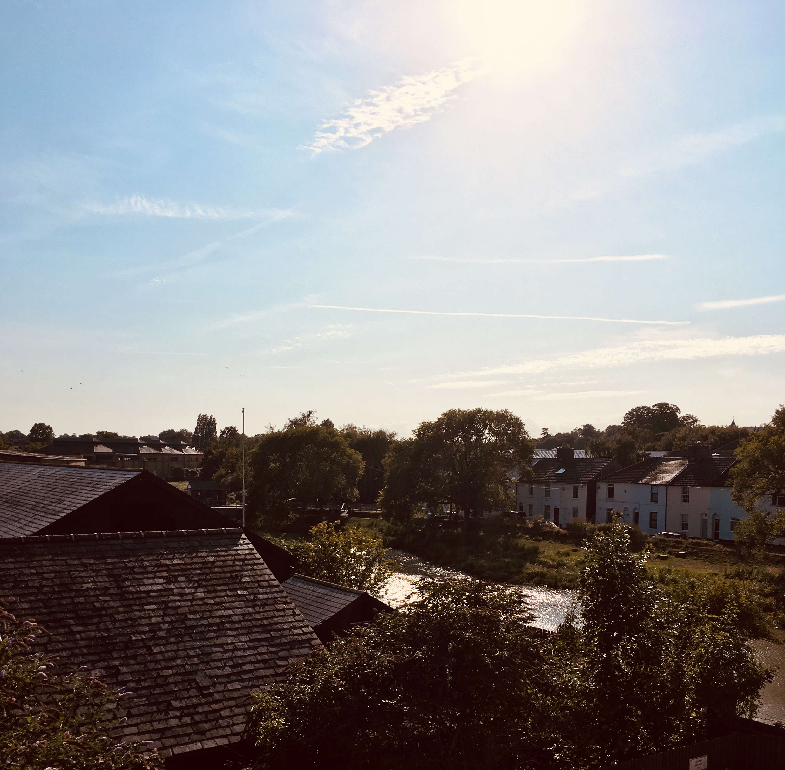

Finding your life's purpose and achieving "work / life balance" can generally be thought of as myths for most people. A very small fraction of society knows their "purpose" in life, and I'd probably put a bet on it that even the majority of those people are only pretending to have their shit together anyway. Work / life balance is another slippery ideal preached to us by workplace "mindfulness" initiatives that seek to put both the blame and pressure to fix the problem back on us workers.

I digress... this series is not about bemoaning our situations, nor is it even technically about finding our specific life purpose. Before I put you off completely, comprehend this:

To live our purpose, we have to know and trust ourselves to live our purpose, even though we don't know what it is yet. 

Read that again. It might be hard to wrap your head around now, but we'll go deeper over the course of this and the next four articles and I promise that not only will it make sense, but it will even help you find your purpose - for now just accept this paradox, we'll dive deeper later on. 

Without further ado, step 1: Evaluate your work / life balance. 

We don't have to drag ourselves through our work day and then collapse on the couch watching TV/Netflix wishing it was the weekend. Yet that is what most people do, day in, day out. Some people are happy with that, but the fact that you're reading this article is a sign that you want something to change. The change is realising this:

We can do all the amazing weekend things WHENEVER we want!

Like RIGHT NOW. We can go on a bike ride, for a walk, swimming, sit in the sun, and sip smoothies... here, wherever you are, now. This is the secret. 

Take a walk around the park at lunch time, maybe get up early and take a yoga class before work, read a trashy romance novel on the bus on the way home, buy some seasonal berries and make a smoothie and sip it looking out of your window while you bird watch (or people watch). If you have flexible working options, take advantage of them! Pick up your kids from school and go get ice cream! None of these things cost the earth, and the more you do them, the less you will need to spend at the weekend to have a "good time" before it's Monday and you have to start the dragging yourself through the week again. In fact, you'll even stop wishing it was the weekend, because you'll be doing all the fun things all the time! 

The hardest thing we need to do is not carving out the extra time (trust me, we all have extra time), but overcoming the current habits we have. Our minds will throw tantrums as we try to override the tendency we have to switch on the TV, or scroll social media. Our minds will say "Oh you've had a hard day, you're too tired to go for a walk in the sun, or make yourself a smoothie, or create something... Just watch the tv...". This is a natural, biological response, not a sign that you're a failure. To overcome this, we need to practice being present, in the here and now. Maybe you start by noticing that you weren't present when you automatically switched on the tv and sat down. That's progress! Noticing yourself not being present, is being present. Maybe next time you notice, you shut off the TV and do something else, anything else, it might be another one of your tendencies like napping, but it broke the first habit. Each time, just realising, that right now is a new moment, where we can do literally ANYTHING. And then doing literally anything. The point is that we're actively choosing what to do, not allowing autopilot to drive us. 

I'll tell you how changing one thing changed everything for me: I decided to start work an hour early, so I could have a two hour lunch break instead and stop lunching on autopilot - scoffing down a sandwich, thinking about work the whole time, then wondering where on earth my hour had gone. I now use the extra hour for appointments, walking around town chatting to my favourite shop keepers, cooking and eating real food... And my work day flies by, I have so much extra energy in the afternoon I get twice as much work done and I even have energy after work to choose between exploring the countryside on my new bike, or building my skills outside of work, or writing, or just chilling with my husband. All of this, and I haven't got any extra hours in my day, I haven't sacrificed sleep, I've just started actually piloting my plane instead of living on autopilot. 

Take the next seven days to practice being present instead of on autopilot. In the morning when you wake up, practice it when you want to press snooze (even if you press snooze, noticing yourself doing that is progress!) Practice it when you're at work sipping your tea, really appreciate the moment you sip your tea, and then go back to work. Practice it picking the kids up from school, or when cooking, or when listening to Spotify. And then practice shaking it up, take the kids to get ice cream, buy a new ingredient to cook with, walk a different way home. The less we're on autopilot, the more time we have, and the more time we have, the more amazing things we can do instead of waiting for the weekend. 