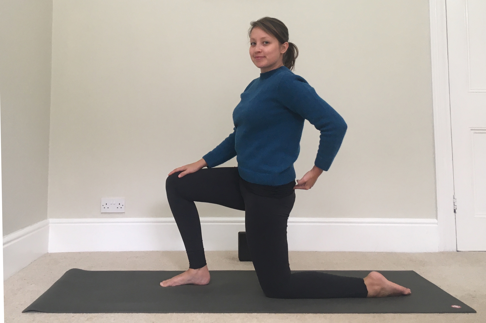

Do you have tight hamstrings? Do you _really_ have tight hamstrings? Or do you just _think_ you have tight hamstrings? Chances are you might not have tight hamstrings at all, but that does seem to be the common misconception because they _FEEL_ tight! What you most probably have, especially if you sit down a lot or even if you move a lot but in one dimension, like running or cycling, is _overly stretched_ hamstrings. So every time you do yoga to "lengthen your hamstrings", you probably aren't doing much of anything (and could be exacerbating the problem!) 

So what's the cause of overly stretched hamstrings? It tends to be an anteriorly tilted pelvis - a fancy sounding way of saying poor posture, which is aflicting more and more people in the 21st Century, even if you exercise a lot. The reason being that the hamstrings attach to the bottom of the pelvis, and if the pelvis is titled, the hamstrings will be pulled on, over time they become like an overly stretched elastic band, weak and unable to stretch further or contract when we need them to, like when we want to touch our toes or for efficient energy tranfer when running for example. 

Well what causes an anteriorly tilted pelvis then? WEAK GLUTES! Which actually causes a whole host of other problems which we explore in later posts, such as "tight" hip flexors, weak abdominals, weak pelvic floor - it's all tied together and they all impact one another. Which is good news! We can work on our glutes and simultaneously work on all the connecting structures. 

The pose in the photo is a LYT method low lunge. Distinctly different from a typical yoga low lunge, this is based on how we develop the ability to stand upright as an infant, something we need to retrain our brain to do in order to override bad habits we've built over a lifetime. You may be thinking, "well I can obviously stand up, so why do I need to retrain my brain?" The answer is that our bodies are very adaptive, so when our glutes become weak, our other, less equipped muscles will pick up the slack, but it's not a great solution. 

Instead of sinking into the hips and tipping the pelvis (as in the typical yoga lunge) the pose is very upright, with the hip and knee angles all at 90 degrees. To strengthen the glutes we need to remind them to do their job, as you can see me doing in the photo, giving my left gluteus maximus a poke and reminding the muscles to engage. This engagement allows the pelvis to maintain a neutral position and begins retraining the brain to eventually do this without us having to consciously clench or poke our butt. 

There's even more going on in the right hand side - the right foot in the photo is energetically being dragged backwards, engaging and strengthening the hamstring. The neutral pelvis and both bent legs allow our hamstrings to have a rest from being overly stretched and start to strenthen again for more optimal use. Once they are strong, and not being over-stretched and over-used by a tipped pelvis, they'll be supple too.

So give this low lunge a try - really drag that front foot back and engage the glute on the back leg to push the hip forward and get a neutral pelvis. You'll be strenthening your glutes and hamstrings, and not only that, but retraining your brain for optimal movement. 
